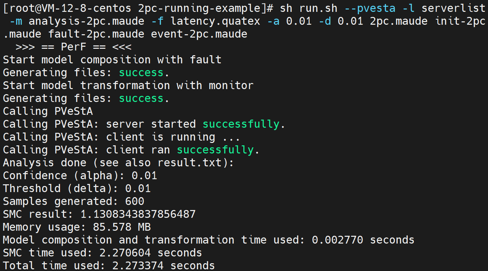

# Running Example: The (Simplified) Two-Phase Commit Protocol
Two-Phase Commit (2PC)  is a distributed atomic commitment protocol that ensures all participants in a transaction either commit or abort. 

Note that here is a slightly simplified version of 2PC, in which a cohort is not required to acknowledge to the coordinator that it has received the decision.

## Running Command

* Command 1: get the model composed with fault injector only
```
sh run.sh 2pc.maude init-2pc.maude 2pc-fault-config.maude
```

* Command 2 (full command): get the model composed with fault injector and monitor, and do statistical model checking(SMC) by calling PVeStA

```
sh run.sh --pvesta -l serverlist -m analysis-2pc.maude -f latency.quatex -a 0.01 -d 0.01 2pc.maude init-2pc.maude 2pc-fault-config.maude event-2pc.maude
```

* Command 3: get the model composed with fault injector and monitor
```
sh run.sh 2pc.maude init-2pc.maude 2pc-fault-config.maude event-2pc.maude
```

## Example Running Result

Following figure shows a screenshot of PerF running under the command 2 (full command).
It shows that the model composition and model transformation complete instantly.
Moreover, 600 simulations finish in approximately 2.27 seconds and yield an
expected average latency of 1.13 (time units), using 85.578 MB of memory.


The SMC result of an example run is also in file [result.txt](result.txt)

## File Structure

```
├── input-modules/      
├── output-fault-comp/  
├── output-moni-tran/   
├── tool/       
├── fault-injector.maude  
├── events.maude
├── run.sh
├── analysis-2pc.maude
├── latency.quatex
├── result.txt
├── ...  # other auxiliary files        
└── README.md
```

## File Description

| Path / File               | Description |
|-------------------------- |-------------|
| `input-modules/`          | Original user-provided 2PC model and initialization modules, with fault and event configuration, which is `2pc.maude`,`init-2pc.maude`,`2pc-fault-config.maude`,`event-2pc.maude` |
| `output-fault-comp/`      | Generated files after **model preprocessing** and **model composition** (faults injected). |
| `output-moni-tran/`       | Generated files after **model transformation** (monitor instrumentation applied). |
| `tool/`                   | Internal scripts used by PerF for processing this example. |
| `run.sh`                  | Main script to run PerF. |
| `analysis-2pc.maude`      | Maude module defining analysis functions for SMC (e.g., average latency computation). |
| `fault-injector.maude`    | Fault-injection library. |
| `events.maude`            | Event-monitoring mechanism. |
| `latency.quatex`          | QuaTEx formula
| `result.txt`              | SMC result of running. |
| `README.md`               | Documentation for this 2PC running example. |
