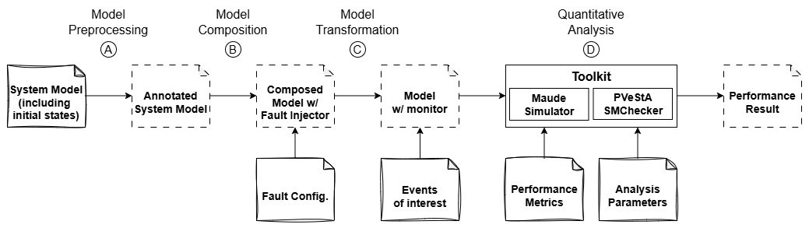

# PerF: Predicting the Performance of Distributed Systems under Faults from Their Formal Designs

## Introduction

PerF is a command-line tool for automating fault injection on formal distributed system models written in Maude,
enabling quantitative analysis of performance metrics (such as latency and throughput) for distributed system models under diverse faults.

Currently, PerF supports seven representative faults, covering both benign and Byzantine fault behaviors commonly observed in realistic distributed environments:

- message loss
- message duplication
- message abnormal delay
- network partition
- node crash
- tampering
- equivocation

PerF also allows users to configure which faults to inject and when to inject them, and provides a monitor that records events of interest at runtime, based on which users can define desired performance properties.

Our insight for the design of PerF is that all these faults can be viewed as manipulations of messages exchanged between actors in distributed system model.  
This not only simplifies the modeling of individual faults 
but also provide capabilities for extending the tool with new faults.

## Pipeline of PerF


The pipeline of PerF consists of four steps:

- A. Model preprocessing: attaches source rule label to messages, and prepares object-triggered rules for deterministic execution.

- B. Model composition with fault injector: integrates the user's system model with our fault injection framework.

- C. (Optional) Model transformation with monitor: instruments the model with a runtime monitor for event logging.

- D. (Optional) Quantitative analysis: uses PVeStA to evaluate performance metrics expressed by QuaTEx, such as latency and throughput, under injected faults.

Further details of our fault-injection mechanism are provided in the accompanying technical report [PerF.pdf](./PerF.pdf)

## Repository structure

```
.
├── 2pc-running-example/   # Running example: simplified Two-Phase Commit protocol
├── case-study             # Case studies
├── PerF.pdf               # Our technical report on PerF
├── images                 # Figures for description docs
└── README.md
```

## Tool Setup

To run the tool successfully, the following environment is required:

- Operating System: Linux (We conduct experiments on CentOS Linux 7)

- Python Versions Supported: Python 2.7, or Python 3.7 (We conduct experiments one these two Python version)

- Maude Version: [Maude 2.7.1](https://github.com/maude-lang/Maude) (required for PVeStA)

- Java Runtime: Java 1.8 (required for PVeStA)

- [PVeStA](http://maude.cs.uiuc.edu/tools/pvesta/): the executable jar file is already included in the repository.

Ensure that the following commands are available globally (in system `$PATH`):
```
python --version  # Python 2.7 or Python 3.7 recommended
maude             # Should be Maude 2.7.1
java -version     # Must be Java 1.8
```

## Command Pattern
All tool commands follow the unified format:
```
sh run.sh [--pvesta serverlist ana-model quatex confidence] protocol init fault [event]
```
**Explanation of arguments**
| Argument     | Required? | Description                                                                 |
| ------------ | --------- | --------------------------------------------------------------------------- |
| `protocol`   | ✔         | User-provided system model (e.g. `2pc.maude`)                              |
| `init`       | ✔         | Module defining the initial system configuration (e.g., `init-2pc.maude`)   |
| `fault`      | ✔         | Module defining injected fault behaviors (e.g., `2pc-fault-config.maude`)          |
| `event`      | optional  | Event declaration module for model transformation (e.g., `event-2pc.maude`) |
| `--pvesta`   | optional  | Enables quantitative analysis using PVeStA. Once enabled, following arguments are all required                   |
| `serverlist` | optional  | PVeStA server configuration file                                            |
| `analysis-model`  | optional  | Maude module containing analysis functions (e.g., latency computation)      |
| `quatex`     | optional  | QuaTEx formula                                             |
| `confidence` | optional  | Confidence level, usually 0.05           |
| `threshold` | optional  | Error margin, usually 0.01                      |

This command pattern is valid for all case studies.
Each case directory contains its own README with the specific commands required. 

We recommend that users begin with our [running example](./2pc-running-example).
